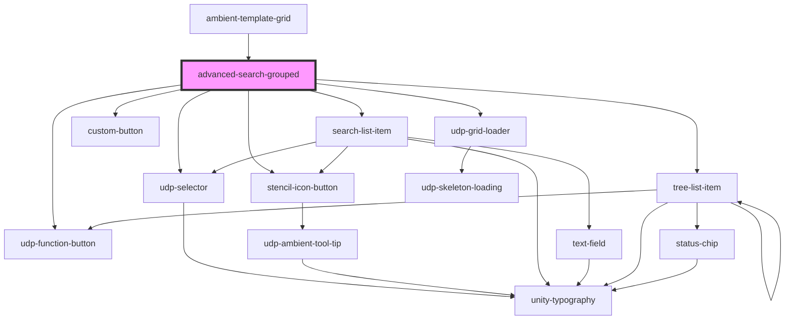

# advanced-search

<!-- Auto Generated Below -->

## Properties

| Property                  | Attribute     | Description | Type                                                                                    | Default     |
| ------------------------- | ------------- | ----------- | --------------------------------------------------------------------------------------- | ----------- |
| `fetchFilters`            | --            |             | `Function`                                                                              | `undefined` |
| `filterList`              | --            |             | `any[]`                                                                                 | `[]`        |
| `filterObjectsWithGroups` | --            |             | `FilterGroup[]`                                                                         | `[]`        |
| `filterRenderList`        | --            |             | `any[]`                                                                                 | `[]`        |
| `fullClearSearch`         | --            |             | `() => void`                                                                            | `undefined` |
| `handleAddNewFilter`      | --            |             | `(groupId: string, otherId: string) => void`                                            | `undefined` |
| `handleAddNewGroup`       | --            |             | `(groupId: string, logicalOperator: "AND" \| "OR") => void`                             | `undefined` |
| `handleDelete`            | --            |             | `(arg0: object) => void`                                                                | `undefined` |
| `handleGroupItemDelete`   | --            |             | `(filterGroupId: string) => void`                                                       | `undefined` |
| `handleItemClick`         | --            |             | `(item: { searchField: string; searchOperator: string; searchValue: string; }) => void` | `undefined` |
| `handleValueChanged`      | --            |             | `(event: CustomEvent<any>) => void`                                                     | `undefined` |
| `recentSearchesOptions`   | --            |             | `any[]`                                                                                 | `[]`        |
| `searchData`              | `search-data` |             | `any`                                                                                   | `undefined` |
| `selectRecentSearch`      | --            |             | `(e: any) => void`                                                                      | `undefined` |
| `updateLogicalOperator`   | --            |             | `(groupId: string, logicalOperator: "AND" \| "OR") => void`                             | `undefined` |

## Events

| Event                      | Description | Type               |
| -------------------------- | ----------- | ------------------ |
| `advancedSearchItemChange` |             | `CustomEvent<any>` |
| `searchItemChanged`        |             | `CustomEvent<any>` |

## Dependencies

### Used by

 - [ambient-template-grid](../grid/ambient-template-grid)

### Depends on

- [udp-selector](../selector)
- [stencil-icon-button](../buttons/icon-button)
- [search-list-item](../data-display/tree/tree-list-item/search-item)
- [custom-button](../buttons/icon-button/primary-button)
- [udp-function-button](../buttons/icon-button/function-button)
- [udp-grid-loader](../loaders/udp-grid-loader)
- [tree-list-item](../data-display/tree/tree-list-item)

### Graph

----------------------------------------------

*Built with [StencilJS](https://stenciljs.com/)*
