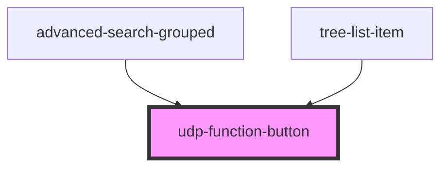

# udp-function-button

<!-- Auto Generated Below -->

## Properties

| Property       | Attribute       | Description | Type      | Default |
| -------------- | --------------- | ----------- | --------- | ------- |
| `add`          | `add`           |             | `boolean` | `false` |
| `delete`       | `delete`        |             | `boolean` | `false` |
| `edit`         | `edit`          |             | `boolean` | `false` |
| `expand`       | `expand`        |             | `boolean` | `false` |
| `isDefault`    | `is-default`    |             | `boolean` | `false` |
| `noBackground` | `no-background` |             | `boolean` | `false` |
| `view`         | `view`          |             | `boolean` | `false` |

## Dependencies

### Used by

 - [advanced-search-grouped](../../../advanced-search)
 - [tree-list-item](../../../data-display/tree/tree-list-item)

### Graph

----------------------------------------------

*Built with [StencilJS](https://stenciljs.com/)*
