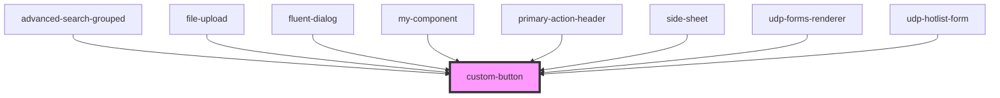

# custom-button

<!-- Auto Generated Below -->

## Properties

| Property    | Attribute   | Description | Type                              | Default     |
| ----------- | ----------- | ----------- | --------------------------------- | ----------- |
| `disabled`  | `disabled`  |             | `boolean`                         | `false`     |
| `label`     | `label`     |             | `string`                          | `undefined` |
| `secondary` | `secondary` |             | `boolean`                         | `false`     |
| `size`      | `size`      |             | `"default" \| "short" \| "tall"`  | `'default'` |
| `type`      | `type`      |             | `"button" \| "reset" \| "submit"` | `'button'`  |
| `variant`   | `variant`   |             | `"default" \| "outline"`          | `'default'` |

## Events

| Event         | Description | Type                |
| ------------- | ----------- | ------------------- |
| `customClick` |             | `CustomEvent<void>` |

## Dependencies

### Used by

 - [advanced-search-grouped](../../../advanced-search)
 - [file-upload](../../../inputs/file-upload)
 - [fluent-dialog](../../../dialogs/fluent-dialog)
 - [my-component](../../../..)
 - [primary-action-header](../../../data-display/primary-action-header)
 - [side-sheet](../../../drawers/side-sheet)
 - [udp-forms-renderer](../../../forms/udp-forms/udp-forms-renderer)
 - [udp-hotlist-form](../../../grid/hotlists/udp-hotlist-form)

### Graph

----------------------------------------------

*Built with [StencilJS](https://stenciljs.com/)*
