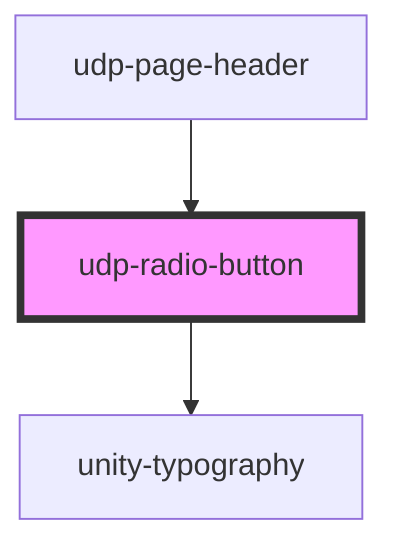

# udp-radio-button

<!-- Auto Generated Below -->

## Properties

| Property   | Attribute  | Description | Type      | Default     |
| ---------- | ---------- | ----------- | --------- | ----------- |
| `checked`  | `checked`  |             | `boolean` | `false`     |
| `disabled` | `disabled` |             | `boolean` | `false`     |
| `label`    | `label`    |             | `string`  | `undefined` |
| `name`     | `name`     |             | `string`  | `undefined` |
| `value`    | `value`    |             | `string`  | `undefined` |

## Dependencies

### Used by

 - [udp-page-header](../../../data-display/headers/udp-page-header)

### Depends on

- [unity-typography](../../../..)

### Graph

----------------------------------------------

*Built with [StencilJS](https://stenciljs.com/)*
