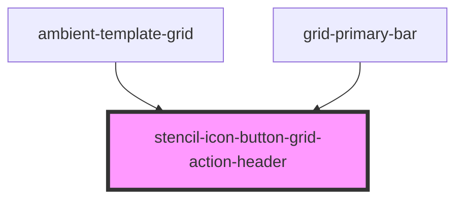

# stencil-icon-button

<!-- Auto Generated Below -->

## Properties

| Property        | Attribute         | Description | Type                          | Default     |
| --------------- | ----------------- | ----------- | ----------------------------- | ----------- |
| `darkIcon`      | `dark-icon`       |             | `boolean`                     | `true`      |
| `icon`          | `icon`            |             | `any`                         | `undefined` |
| `iconClassName` | `icon-class-name` |             | `string`                      | `undefined` |
| `iconName`      | `icon-name`       |             | `string`                      | `undefined` |
| `noBackground`  | `no-background`   |             | `boolean`                     | `false`     |
| `onClick`       | --                |             | `(event: MouseEvent) => void` | `undefined` |
| `secondary`     | `secondary`       |             | `boolean`                     | `false`     |
| `showLabel`     | `show-label`      |             | `boolean`                     | `true`      |
| `tooltip`       | `tooltip`         |             | `string`                      | `undefined` |

## Dependencies

### Used by

 - [ambient-template-grid](../../grid/ambient-template-grid)
 - [grid-primary-bar](../../grid/grid-primary-bar)

### Graph

----------------------------------------------

*Built with [StencilJS](https://stenciljs.com/)*
