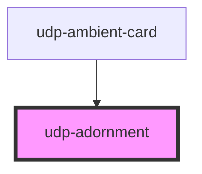

# udp-adornment

<!-- Auto Generated Below -->

## Properties

| Property | Attribute | Description | Type                                                        | Default     |
| -------- | --------- | ----------- | ----------------------------------------------------------- | ----------- |
| `status` | `status`  |             | `"disabled" \| "error" \| "info" \| "success" \| "warning"` | `undefined` |

## Dependencies

### Used by

 - [udp-ambient-card](../../cards/udp-ambient-card)

### Graph

----------------------------------------------

*Built with [StencilJS](https://stenciljs.com/)*
