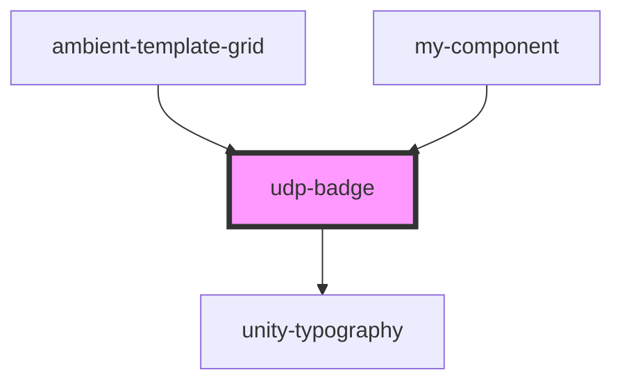

# udp-badge

<!-- Auto Generated Below -->

## Properties

| Property  | Attribute | Description | Type     | Default |
| --------- | --------- | ----------- | -------- | ------- |
| `content` | `content` |             | `number` | `0`     |
| `max`     | `max`     |             | `number` | `99`    |

## Dependencies

### Used by

 - [ambient-template-grid](../../grid/ambient-template-grid)
 - [my-component](../../..)

### Depends on

- [unity-typography](../../..)

### Graph

----------------------------------------------

*Built with [StencilJS](https://stenciljs.com/)*
