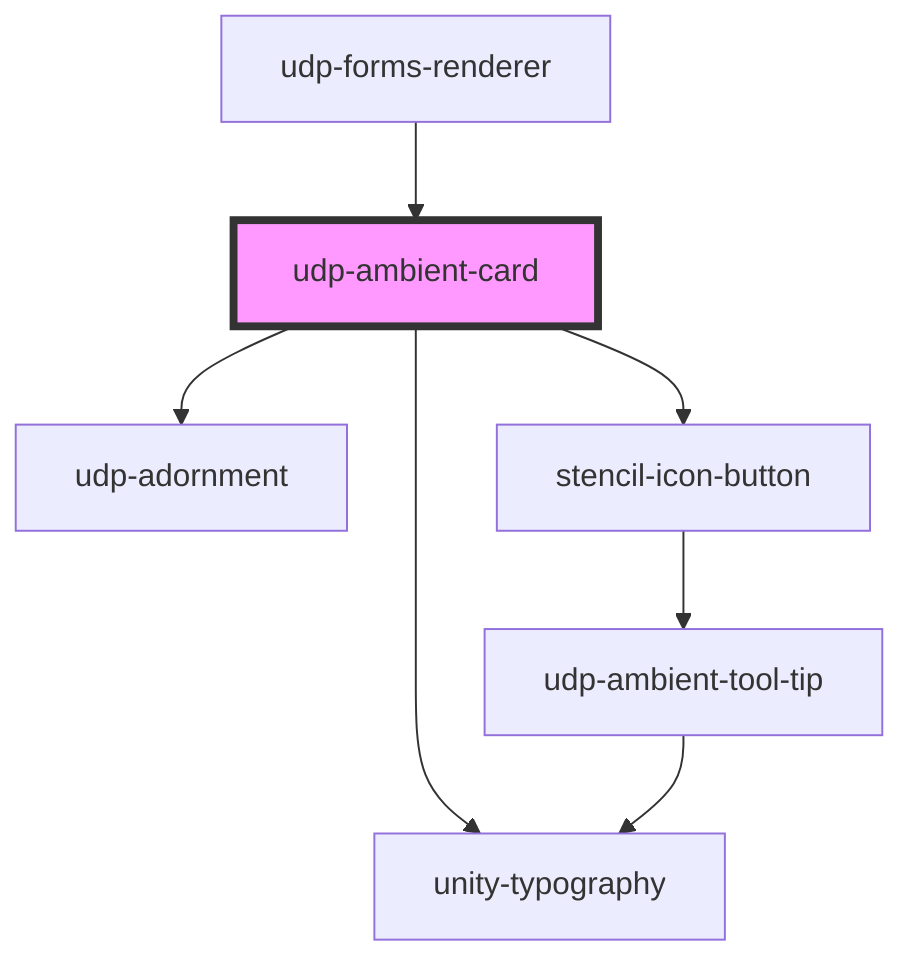

# udp-ambient-card

<!-- Auto Generated Below -->

## Properties

| Property   | Attribute   | Description | Type     | Default   |
| ---------- | ----------- | ----------- | -------- | --------- |
| `moreText` | `more-text` |             | `string` | `''`      |
| `overflow` | `overflow`  |             | `string` | `''`      |
| `width`    | `width`     |             | `string` | `'600px'` |

## Dependencies

### Used by

 - [udp-forms-renderer](../../../forms/udp-forms/udp-forms-renderer)

### Depends on

- [udp-adornment](../../adornment/udp-adornment)
- [unity-typography](../../../..)
- [stencil-icon-button](../../../buttons/icon-button)

### Graph

----------------------------------------------

*Built with [StencilJS](https://stenciljs.com/)*
