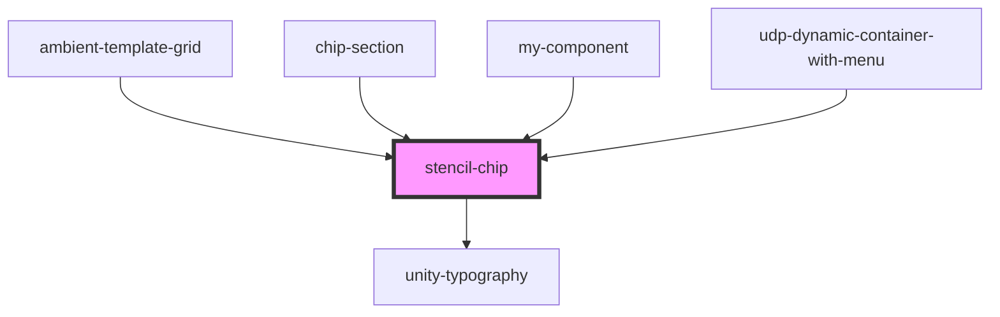

# stencil-chip

<!-- Auto Generated Below -->

## Properties

| Property               | Attribute                | Description | Type                       | Default     |
| ---------------------- | ------------------------ | ----------- | -------------------------- | ----------- |
| `color`                | `color`                  |             | `"primary" \| "secondary"` | `'primary'` |
| `defaultToggled`       | `default-toggled`        |             | `boolean`                  | `false`     |
| `externalToggleString` | `external-toggle-string` |             | `string`                   | `undefined` |
| `leftIcon`             | `left-icon`              |             | `any`                      | `undefined` |
| `level`                | `level`                  |             | `number`                   | `0`         |
| `showDelete`           | `show-delete`            |             | `boolean`                  | `true`      |
| `showLeftIcon`         | `show-left-icon`         |             | `boolean`                  | `false`     |
| `text`                 | `text`                   |             | `string`                   | `undefined` |

## Events

| Event            | Description | Type                   |
| ---------------- | ----------- | ---------------------- |
| `onDelete`       |             | `CustomEvent<void>`    |
| `onToggle`       |             | `CustomEvent<boolean>` |
| `udpChipClicked` |             | `CustomEvent<string>`  |

## Dependencies

### Used by

 - [ambient-template-grid](../../../grid/ambient-template-grid)
 - [chip-section](../../../../../../udp-utilities/layout/udp-dynamic-container-with-menu/chip-section)
 - [my-component](../../../..)
 - [udp-dynamic-container-with-menu](../../../../../../udp-utilities/layout/udp-dynamic-container-with-menu)

### Depends on

- [unity-typography](../../../..)

### Graph

----------------------------------------------

*Built with [StencilJS](https://stenciljs.com/)*
