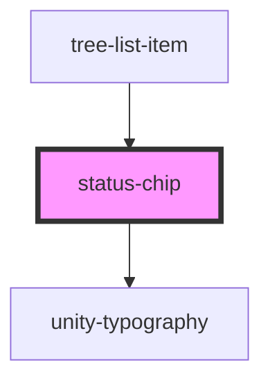

# status-chip

<!-- Auto Generated Below -->

## Properties

| Property        | Attribute      | Description | Type                         | Default     |
| --------------- | -------------- | ----------- | ---------------------------- | ----------- |
| `statusClasses` | --             |             | `{ [key: string]: string; }` | `{}`        |
| `statusValue`   | `status-value` |             | `boolean \| string`          | `undefined` |

## Dependencies

### Used by

 - [tree-list-item](../../../tree/tree-list-item)

### Depends on

- [unity-typography](../../../../..)

### Graph

----------------------------------------------

*Built with [StencilJS](https://stenciljs.com/)*
