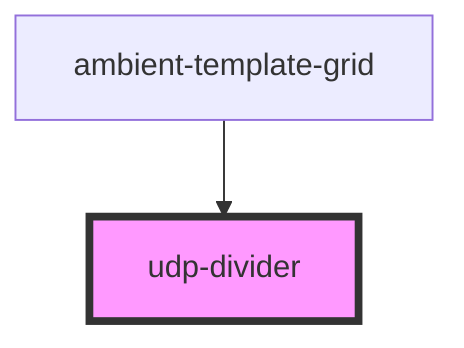

# udp-divider

<!-- Auto Generated Below -->

## Properties

| Property  | Attribute | Description | Type                         | Default        |
| --------- | --------- | ----------- | ---------------------------- | -------------- |
| `size`    | `size`    |             | `string`                     | `undefined`    |
| `variant` | `variant` |             | `"horizontal" \| "vertical"` | `'horizontal'` |

## Dependencies

### Used by

 - [ambient-template-grid](../../grid/ambient-template-grid)

### Graph

----------------------------------------------

*Built with [StencilJS](https://stenciljs.com/)*
