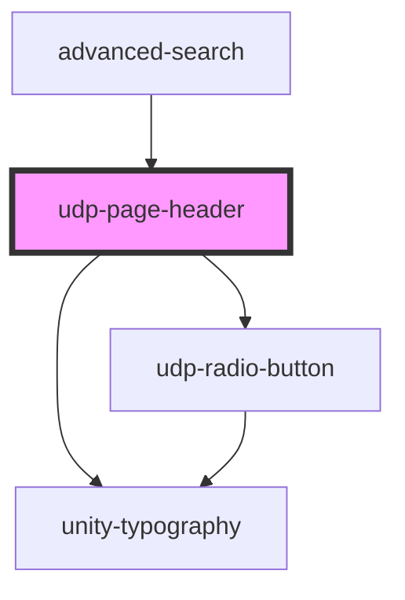

# udp-page-header

<!-- Auto Generated Below -->

## Events

| Event          | Description | Type               |
| -------------- | ----------- | ------------------ |
| `valueChanged` |             | `CustomEvent<any>` |

## Dependencies

### Used by

 - [advanced-search](../../../advanced-search)

### Depends on

- [unity-typography](../../../..)
- [udp-radio-button](../../../buttons/icon-button/radio-button)

### Graph

----------------------------------------------

*Built with [StencilJS](https://stenciljs.com/)*
