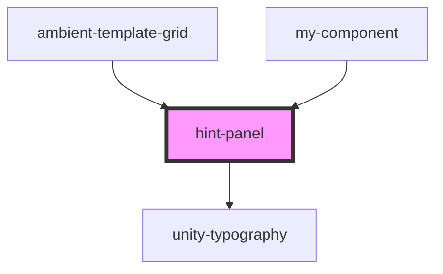

# hint-panel

<!-- Auto Generated Below -->

## Properties

| Property       | Attribute        | Description | Type     | Default     |
| -------------- | ---------------- | ----------- | -------- | ----------- |
| `hideHintText` | `hide-hint-text` |             | `string` | `undefined` |
| `hint`         | `hint`           |             | `string` | `undefined` |

## Dependencies

### Used by

 - [ambient-template-grid](../../grid/ambient-template-grid)
 - [my-component](../../..)

### Depends on

- [unity-typography](../../..)

### Graph

----------------------------------------------

*Built with [StencilJS](https://stenciljs.com/)*
