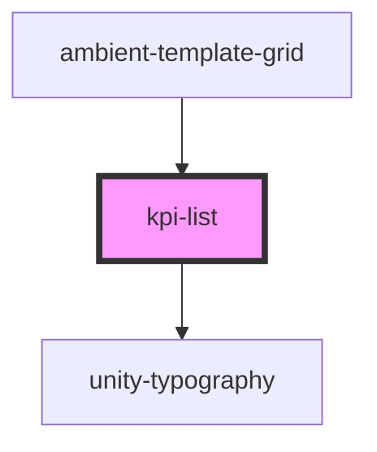

# kpi-list

<!-- Auto Generated Below -->

## Properties

| Property    | Attribute | Description | Type                                  | Default     |
| ----------- | --------- | ----------- | ------------------------------------- | ----------- |
| `kpiValues` | --        |             | `{ label: string; value: number; }[]` | `undefined` |

## Dependencies

### Used by

 - [ambient-template-grid](../../grid/ambient-template-grid)

### Depends on

- [unity-typography](../../..)

### Graph

----------------------------------------------

*Built with [StencilJS](https://stenciljs.com/)*
