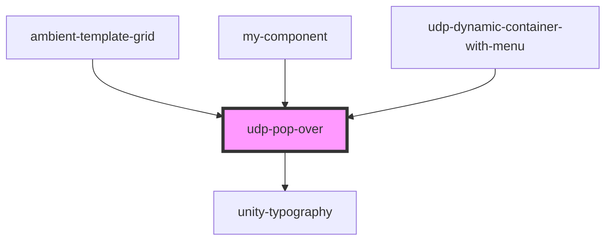

# udp-pop-over

<!-- Auto Generated Below -->

## Properties

| Property        | Attribute | Description | Type          | Default     |
| --------------- | --------- | ----------- | ------------- | ----------- |
| `anchorElement` | --        |             | `HTMLElement` | `undefined` |
| `isOpen`        | `is-open` |             | `boolean`     | `false`     |

## Dependencies

### Used by

 - [ambient-template-grid](../../grid/ambient-template-grid)
 - [my-component](../../..)
 - [udp-dynamic-container-with-menu](../../../../../udp-utilities/layout/udp-dynamic-container-with-menu)

### Depends on

- [unity-typography](../../..)

### Graph

----------------------------------------------

*Built with [StencilJS](https://stenciljs.com/)*
