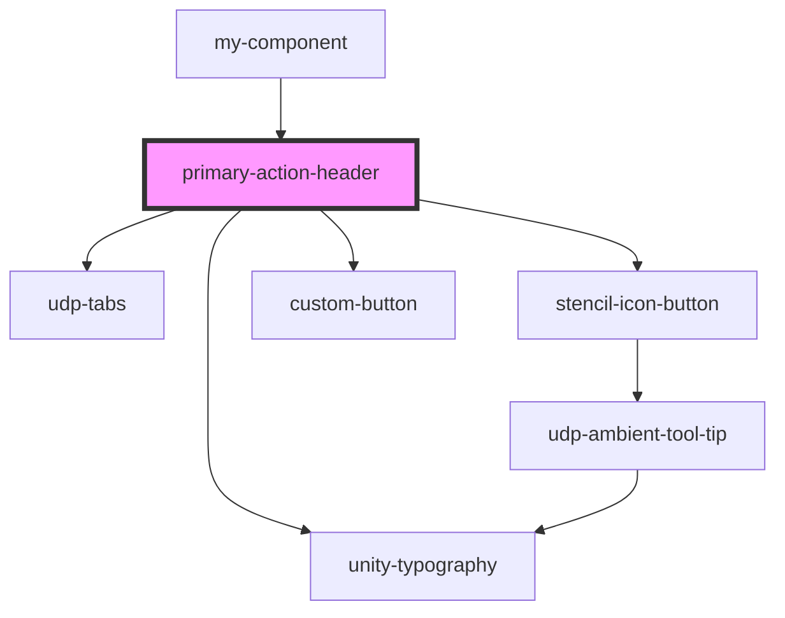

# primary-action-header

<!-- Auto Generated Below -->

## Properties

| Property                | Attribute             | Description | Type                           | Default     |
| ----------------------- | --------------------- | ----------- | ------------------------------ | ----------- |
| `actionButtonLabel`     | `action-button-label` |             | `string`                       | `''`        |
| `actionButtons`         | --                    |             | `any[]`                        | `[]`        |
| `activeTabIndex`        | `active-tab-index`    |             | `number`                       | `undefined` |
| `customClearClick`      | --                    |             | `(event?: MouseEvent) => void` | `undefined` |
| `customColumnViewClick` | --                    |             | `(event?: MouseEvent) => void` | `undefined` |
| `customExpandClick`     | --                    |             | `(event?: MouseEvent) => void` | `undefined` |
| `customExportClick`     | --                    |             | `(event?: MouseEvent) => void` | `undefined` |
| `customFilterViewClick` | --                    |             | `(event?: MouseEvent) => void` | `undefined` |
| `customFitColumnClick`  | --                    |             | `(event?: MouseEvent) => void` | `undefined` |
| `customSaveViewClick`   | --                    |             | `(event?: MouseEvent) => void` | `undefined` |
| `customShowViewClick`   | --                    |             | `(event?: MouseEvent) => void` | `undefined` |
| `customSizeToFitClick`  | --                    |             | `(event?: MouseEvent) => void` | `undefined` |
| `defaultActionButtons`  | --                    |             | `any[]`                        | `[]`        |
| `hiddenActionButtons`   | --                    |             | `string[]`                     | `[]`        |
| `hiddenLabels`          | --                    |             | `string[]`                     | `[]`        |
| `primaryActionClick`    | --                    |             | `(event?: MouseEvent) => void` | `undefined` |
| `selectTab`             | --                    |             | `(index: number) => void`      | `undefined` |
| `tabs`                  | `tabs`                |             | `boolean`                      | `true`      |
| `title`                 | `title`               |             | `string`                       | `undefined` |

## Dependencies

### Used by

 - [my-component](../../..)

### Depends on

- [unity-typography](../../..)
- [udp-tabs](../../tabs/tab/tabs)
- [stencil-icon-button](../../buttons/icon-button)
- [custom-button](../../buttons/icon-button/primary-button)

### Graph

----------------------------------------------

*Built with [StencilJS](https://stenciljs.com/)*
