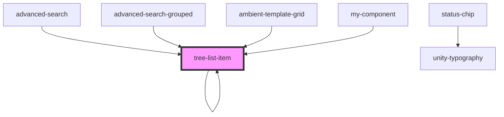

# tree-list-item

<!-- Auto Generated Below -->

## Properties

| Property                   | Attribute                      | Description | Type                          | Default               |
| -------------------------- | ------------------------------ | ----------- | ----------------------------- | --------------------- |
| `add`                      | `add`                          |             | `boolean`                     | `false`               |
| `customAttribute`          | `custom-attribute`             |             | `string`                      | `undefined`           |
| `dataOne`                  | `data-one`                     |             | `string`                      | `undefined`           |
| `dataTwo`                  | `data-two`                     |             | `string`                      | `undefined`           |
| `deleteHandler`            | --                             |             | `(event: MouseEvent) => void` | `undefined`           |
| `editHandler`              | --                             |             | `(event: MouseEvent) => void` | `undefined`           |
| `gridViewVisibilityTypeId` | `grid-view-visibility-type-id` |             | `number`                      | `undefined`           |
| `isDefault`                | `is-default`                   |             | `boolean`                     | `false`               |
| `label`                    | `label`                        |             | `string`                      | `undefined`           |
| `level`                    | `level`                        |             | `number`                      | `0`                   |
| `nestedItems`              | --                             |             | `any[]`                       | `undefined`           |
| `parent`                   | `parent`                       |             | `string`                      | `undefined`           |
| `parentFilter`             | `parent-filter`                |             | `any`                         | `undefined`           |
| `parentName`               | `parent-name`                  |             | `string`                      | `'defaultParentName'` |
| `parentPath`               | `parent-path`                  |             | `string`                      | `undefined`           |
| `reference`                | `reference`                    |             | `string`                      | `undefined`           |
| `showAdd`                  | `show-add`                     |             | `boolean`                     | `true`                |
| `showDeleteOption`         | `show-delete-option`           |             | `boolean`                     | `false`               |
| `showEditOption`           | `show-edit-option`             |             | `boolean`                     | `false`               |
| `showUpdateDefaultOption`  | `show-update-default-option`   |             | `boolean`                     | `false`               |
| `showViewOption`           | `show-view-option`             |             | `boolean`                     | `false`               |
| `statusClasses`            | --                             |             | `{ [key: string]: string; }`  | `undefined`           |
| `statusKey`                | `status-key`                   |             | `string`                      | `undefined`           |
| `statusLabel`              | `status-label`                 |             | `string`                      | `undefined`           |
| `statusValue`              | `status-value`                 |             | `boolean`                     | `undefined`           |
| `test`                     | `test`                         |             | `string`                      | `undefined`           |
| `updateDefaultHandler`     | --                             |             | `(event: MouseEvent) => void` | `undefined`           |
| `viewHandler`              | --                             |             | `(event: MouseEvent) => void` | `undefined`           |

## Events

| Event               | Description | Type                                                                                                                                       |
| ------------------- | ----------- | ------------------------------------------------------------------------------------------------------------------------------------------ |
| `itemClick`         |             | `CustomEvent<{ searchField: string; searchOperator: string; searchValue: string; parentName?: string; parentPath?: string; }>`             |
| `reference-clicked` |             | `CustomEvent<{ reference: string; name: string; parentReference?: string; parentFilter?: string; parent?: string; parentPath?: string; }>` |

## Dependencies

### Used by

 - [advanced-search](../../../advanced-search)
 - [advanced-search-grouped](../../../advanced-search)
 - [ambient-template-grid](../../../grid/ambient-template-grid)
 - [my-component](../../../..)
 - [tree-list-item](.)

### Depends on

- [tree-list-item](.)
- [unity-typography](../../../..)
- [status-chip](../../chips/stencil-chip/status-chip)
- [udp-function-button](../../../buttons/icon-button/function-button)

### Graph

----------------------------------------------

*Built with [StencilJS](https://stenciljs.com/)*
