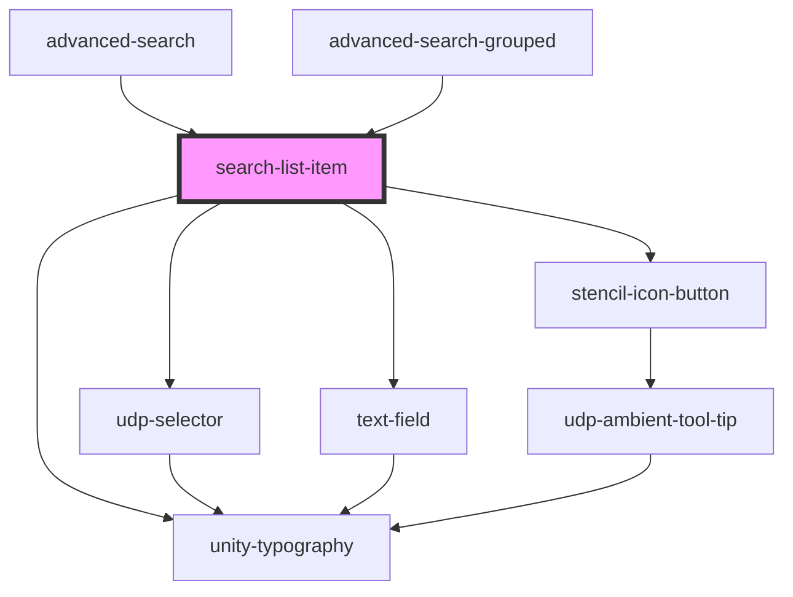

# search-list-item

<!-- Auto Generated Below -->

## Properties

| Property       | Attribute  | Description | Type                          | Default     |
| -------------- | ---------- | ----------- | ----------------------------- | ----------- |
| `groupId`      | `group-id` |             | `string`                      | `undefined` |
| `handleDelete` | --         |             | `(event: MouseEvent) => void` | `undefined` |
| `label`        | `label`    |             | `string`                      | `undefined` |
| `name`         | `name`     |             | `string`                      | `undefined` |
| `operator`     | `operator` |             | `string`                      | `undefined` |

## Events

| Event               | Description | Type               |
| ------------------- | ----------- | ------------------ |
| `searchItemChanged` |             | `CustomEvent<any>` |

## Dependencies

### Used by

 - [advanced-search](../../../../advanced-search)
 - [advanced-search-grouped](../../../../advanced-search)

### Depends on

- [unity-typography](../../../../..)
- [udp-selector](../../../../selector)
- [text-field](../../../../inputs/text-field)
- [stencil-icon-button](../../../../buttons/icon-button)

### Graph

----------------------------------------------

*Built with [StencilJS](https://stenciljs.com/)*
