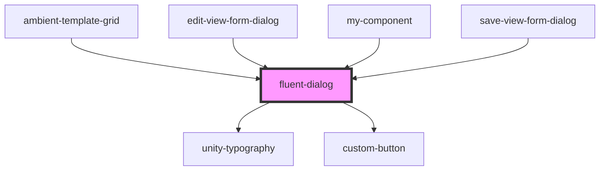

# fluent-dialog

<!-- Auto Generated Below -->

## Properties

| Property          | Attribute           | Description | Type       | Default     |
| ----------------- | ------------------- | ----------- | ---------- | ----------- |
| `actionOne`       | --                  |             | `Function` | `undefined` |
| `actionTwo`       | --                  |             | `Function` | `undefined` |
| `ariaDescribedby` | `aria-describedby`  |             | `string`   | `undefined` |
| `ariaLabelledby`  | `aria-labelledby`   |             | `string`   | `undefined` |
| `buttonOneHidden` | `button-one-hidden` |             | `boolean`  | `false`     |
| `buttonTwoHidden` | `button-two-hidden` |             | `boolean`  | `false`     |
| `descriptionId`   | `description-id`    |             | `string`   | `undefined` |
| `disableOne`      | `disable-one`       |             | `boolean`  | `undefined` |
| `disableTwo`      | `disable-two`       |             | `boolean`  | `undefined` |
| `handleClose`     | --                  |             | `Function` | `undefined` |
| `labelOne`        | `label-one`         |             | `string`   | `undefined` |
| `labelTwo`        | `label-two`         |             | `string`   | `undefined` |
| `message`         | `message`           |             | `string`   | `undefined` |
| `open`            | `open`              |             | `boolean`  | `undefined` |
| `progress`        | `progress`          |             | `number`   | `undefined` |
| `title`           | `title`             |             | `string`   | `undefined` |
| `titleId`         | `title-id`          |             | `string`   | `undefined` |

## Dependencies

### Used by

 - [ambient-template-grid](../../grid/ambient-template-grid)
 - [edit-view-form-dialog](../../forms/edit-view-form)
 - [my-component](../../..)
 - [save-view-form-dialog](../../forms/save-view-form)

### Depends on

- [unity-typography](../../..)
- [custom-button](../../buttons/icon-button/primary-button)

### Graph

----------------------------------------------

*Built with [StencilJS](https://stenciljs.com/)*
