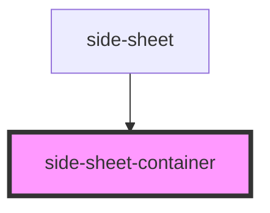

# side-sheet-container

<!-- Auto Generated Below -->

## Properties

| Property  | Attribute | Description | Type      | Default |
| --------- | --------- | ----------- | --------- | ------- |
| `padding` | `padding` |             | `boolean` | `true`  |

## Dependencies

### Used by

 - [side-sheet](.)

### Graph

----------------------------------------------

*Built with [StencilJS](https://stenciljs.com/)*
