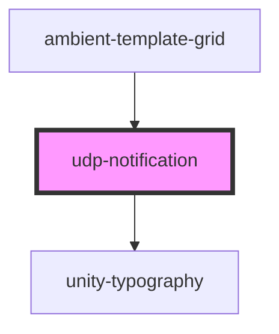

# udp-notification

<!-- Auto Generated Below -->

## Properties

| Property     | Attribute     | Description | Type                                | Default     |
| ------------ | ------------- | ----------- | ----------------------------------- | ----------- |
| `active`     | `active`      |             | `boolean`                           | `false`     |
| `message`    | `message`     |             | `string`                            | `undefined` |
| `status`     | `status`      |             | `"error" \| "success" \| "warning"` | `undefined` |
| `userCancel` | `user-cancel` |             | `boolean`                           | `false`     |

## Dependencies

### Used by

 - [ambient-template-grid](../../grid/ambient-template-grid)

### Depends on

- [unity-typography](../../..)

### Graph

----------------------------------------------

*Built with [StencilJS](https://stenciljs.com/)*
