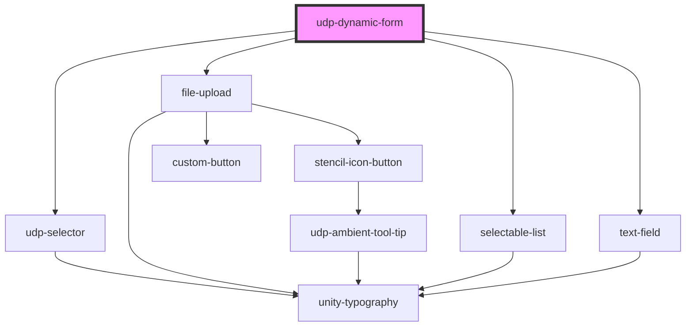

# udp-dynamic-form

<!-- Auto Generated Below -->

## Methods

### `getFormData() => Promise<{ searchField: string; searchOperator: any; searchValue: any; groupId: number; }[]>`

#### Returns

Type: `Promise<{ searchField: string; searchOperator: any; searchValue: any; groupId: number; }[]>`

## Dependencies

### Depends on

- [udp-selector](../../selector)
- [file-upload](../../inputs/file-upload)
- [selectable-list](../../inputs/selectable-list)
- [text-field](../../inputs/text-field)

### Graph

----------------------------------------------

*Built with [StencilJS](https://stenciljs.com/)*
