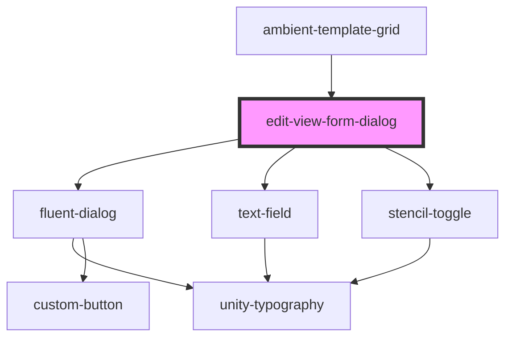

# edit-view-form-dialog

<!-- Auto Generated Below -->

## Properties

| Property                          | Attribute                              | Description | Type                                                                         | Default     |
| --------------------------------- | -------------------------------------- | ----------- | ---------------------------------------------------------------------------- | ----------- |
| `apiCatalogId`                    | `api-catalog-id`                       |             | `any`                                                                        | `undefined` |
| `application`                     | `application`                          |             | `string`                                                                     | `undefined` |
| `closeDialog`                     | `close-dialog`                         |             | `any`                                                                        | `undefined` |
| `currentGridId`                   | `current-grid-id`                      |             | `string`                                                                     | `undefined` |
| `currentGridViewVisibilityTypeId` | `current-grid-view-visibility-type-id` |             | `number`                                                                     | `undefined` |
| `currentIsDefault`                | `current-is-default`                   |             | `boolean`                                                                    | `undefined` |
| `currentName`                     | `current-name`                         |             | `string`                                                                     | `undefined` |
| `domain`                          | `domain`                               |             | `any`                                                                        | `undefined` |
| `entity`                          | `entity`                               |             | `string`                                                                     | `undefined` |
| `gApi`                            | `g-api`                                |             | `any`                                                                        | `undefined` |
| `gcApi`                           | `gc-api`                               |             | `any`                                                                        | `undefined` |
| `gridId`                          | `grid-id`                              |             | `any`                                                                        | `undefined` |
| `handleClose`                     | --                                     |             | `Function`                                                                   | `undefined` |
| `handleFormSubmit`                | --                                     |             | `(gridId: any, name: string, isPrivate: number, isDefault: boolean) => void` | `undefined` |
| `open`                            | `open`                                 |             | `boolean`                                                                    | `undefined` |
| `refetchViews`                    | --                                     |             | `() => void`                                                                 | `undefined` |
| `tenant`                          | `tenant`                               |             | `string`                                                                     | `undefined` |
| `title`                           | `title`                                |             | `string`                                                                     | `undefined` |
| `user`                            | `user`                                 |             | `any`                                                                        | `undefined` |

## Dependencies

### Used by

 - [ambient-template-grid](../../grid/ambient-template-grid)

### Depends on

- [fluent-dialog](../../dialogs/fluent-dialog)
- [text-field](../../inputs/text-field)
- [stencil-toggle](../../inputs/toggle)

### Graph

----------------------------------------------

*Built with [StencilJS](https://stenciljs.com/)*
