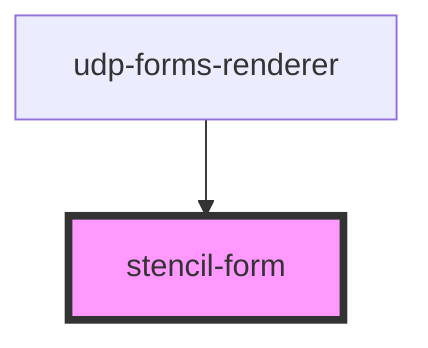

# stencil-form

<!-- Auto Generated Below -->

## Properties

| Property         | Attribute          | Description | Type                                         | Default     |
| ---------------- | ------------------ | ----------- | -------------------------------------------- | ----------- |
| `handleSubmit`   | --                 |             | `(values: Object) => void`                   | `undefined` |
| `initialValues`  | --                 |             | `Object`                                     | `undefined` |
| `validate`       | --                 |             | `(values: Object, errors: Object) => Object` | `undefined` |
| `validateOnBlur` | `validate-on-blur` |             | `boolean`                                    | `true`      |

## Events

| Event                     | Description | Type                  |
| ------------------------- | ----------- | --------------------- |
| `stencilFormInvalidEvent` |             | `CustomEvent<Object>` |

## Dependencies

### Used by

 - [udp-forms-renderer](../udp-forms/udp-forms-renderer)

### Graph

----------------------------------------------

*Built with [StencilJS](https://stenciljs.com/)*
