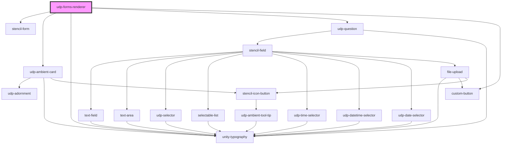

# udp-forms-renderer

<!-- Auto Generated Below -->

## Properties

| Property         | Attribute      | Description | Type                                         | Default     |
| ---------------- | -------------- | ----------- | -------------------------------------------- | ----------- |
| `apiUrlBase`     | `api-url-base` |             | `string`                                     | `null`      |
| `callbackUrl`    | `callback-url` |             | `string`                                     | `undefined` |
| `formId`         | `form-id`      |             | `string`                                     | `undefined` |
| `getAccessToken` | --             |             | `() => Promise<string>`                      | `undefined` |
| `isPublic`       | `is-public`    |             | `boolean`                                    | `false`     |
| `productId`      | `product-id`   |             | `number`                                     | `undefined` |
| `tenantId`       | `tenant-id`    |             | `string`                                     | `undefined` |
| `triggerAction`  | --             |             | `(actionId: string, params: Object) => void` | `undefined` |
| `unityUrl`       | `unity-url`    |             | `string`                                     | `undefined` |
| `version`        | `version`      |             | `number`                                     | `undefined` |

## Dependencies

### Depends on

- [stencil-form](../../form)
- [udp-ambient-card](../../../data-display/cards/udp-ambient-card)
- [unity-typography](../../../..)
- [udp-question](../udp-question)
- [custom-button](../../../buttons/icon-button/primary-button)

### Graph

----------------------------------------------

*Built with [StencilJS](https://stenciljs.com/)*
