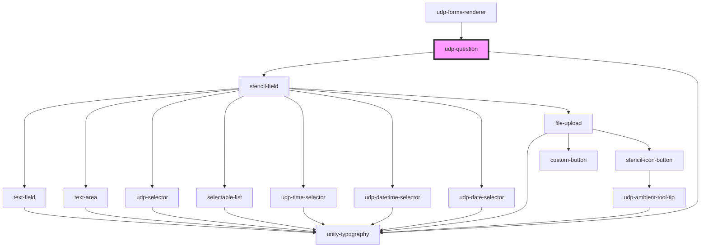

# udp-question

<!-- Auto Generated Below -->

## Properties

| Property         | Attribute         | Description | Type                                                                                        | Default     |
| ---------------- | ----------------- | ----------- | ------------------------------------------------------------------------------------------- | ----------- |
| `question`       | --                |             | `Question`                                                                                  | `undefined` |
| `questionNumber` | `question-number` |             | `number`                                                                                    | `undefined` |
| `styleOverrides` | --                |             | `{ helperText: FontOverrides; questionText: FontOverrides; paragraphText: FontOverrides; }` | `undefined` |
| `value`          | `value`           |             | `string`                                                                                    | `undefined` |

## Dependencies

### Used by

 - [udp-forms-renderer](../udp-forms-renderer)

### Depends on

- [stencil-field](../../form)
- [unity-typography](../../../..)

### Graph

----------------------------------------------

*Built with [StencilJS](https://stenciljs.com/)*
