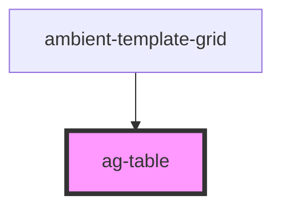

# ag-table

<!-- Auto Generated Below -->

## Properties

| Property      | Attribute    | Description | Type               | Default                 |
| ------------- | ------------ | ----------- | ------------------ | ----------------------- |
| `gridOptions` | --           |             | `GridOptions<any>` | `undefined`             |
| `height`      | `height`     |             | `string`           | `'calc(100vh - 200px)'` |
| `licensekey`  | `licensekey` |             | `string`           | `undefined`             |

## Dependencies

### Used by

 - [ambient-template-grid](../ambient-template-grid)

### Graph

----------------------------------------------

*Built with [StencilJS](https://stenciljs.com/)*
