# ambient-tempalte-grid

<!-- Auto Generated Below -->

## Properties

| Property                    | Attribute                      | Description | Type                                  | Default                                                                                                                                                                                                                                                                                           |
| --------------------------- | ------------------------------ | ----------- | ------------------------------------- | ------------------------------------------------------------------------------------------------------------------------------------------------------------------------------------------------------------------------------------------------------------------------------------------------- |
| `accessToken`               | `access-token`                 |             | `string`                              | `undefined`                                                                                                                                                                                                                                                                                       |
| `actionId`                  | `action-id`                    |             | `string`                              | `''`                                                                                                                                                                                                                                                                                              |
| `additionalFilterChips`     | --                             |             | `any[]`                               | `[]`                                                                                                                                                                                                                                                                                              |
| `apiCatalogId`              | `api-catalog-id`               |             | `string`                              | `""`                                                                                                                                                                                                                                                                                              |
| `apiMethodId`               | `api-method-id`                |             | `string`                              | `""`                                                                                                                                                                                                                                                                                              |
| `buttonTransform`           | `button-transform`             |             | `string`                              | `''`                                                                                                                                                                                                                                                                                              |
| `cellClickHandler`          | --                             |             | `(value: any, callback: any) => void` | `undefined`                                                                                                                                                                                                                                                                                       |
| `cellClickHandlerX`         | --                             |             | `(value: any, callback: any) => void` | `undefined`                                                                                                                                                                                                                                                                                       |
| `columnDefs`                | --                             |             | `any[]`                               | `[]`                                                                                                                                                                                                                                                                                              |
| `columnNames`               | --                             |             | `{ [key: string]: string; }`          | `{}`                                                                                                                                                                                                                                                                                              |
| `dataEmitter`               | `data-emitter`                 |             | `any`                                 | `{}`                                                                                                                                                                                                                                                                                              |
| `dataEmitterRequest`        | `data-emitter-request`         |             | `any`                                 | `{}`                                                                                                                                                                                                                                                                                              |
| `defaultSearchObject`       | --                             |             | `any[]`                               | `[]`                                                                                                                                                                                                                                                                                              |
| `externalPayload`           | `external-payload`             |             | `any`                                 | `null`                                                                                                                                                                                                                                                                                            |
| `externalSearchFilter`      | --                             |             | `any[]`                               | `[]`                                                                                                                                                                                                                                                                                              |
| `filterObject`              | --                             |             | `any[]`                               | `[     {       "pageNumber": 1,       "pageSize": 20,       "filterElements": [],       "orderElements": [],       "groupingType": "",       "groupProperty": [],       "groupOperationList": [],       "eagerLoad": false,       "logicalSearchOperator": 2,       "type": "advanced"     }   ]` |
| `fitGrid`                   | `fit-grid`                     |             | `string`                              | `''`                                                                                                                                                                                                                                                                                              |
| `fullViewData`              | `full-view-data`               |             | `any`                                 | `{}`                                                                                                                                                                                                                                                                                              |
| `gridBarTitle`              | `grid-bar-title`               |             | `string`                              | `""`                                                                                                                                                                                                                                                                                              |
| `gridId`                    | `grid-id`                      |             | `string`                              | `""`                                                                                                                                                                                                                                                                                              |
| `gridState`                 | --                             |             | `any[]`                               | `[]`                                                                                                                                                                                                                                                                                              |
| `hotListIdentifier`         | `hot-list-identifier`          |             | `string`                              | `""`                                                                                                                                                                                                                                                                                              |
| `kpiValues`                 | --                             |             | `any[]`                               | `[]`                                                                                                                                                                                                                                                                                              |
| `maxChipsAllowed`           | `max-chips-allowed`            |             | `number`                              | `5`                                                                                                                                                                                                                                                                                               |
| `menuItems`                 | --                             |             | `any[]`                               | `[]`                                                                                                                                                                                                                                                                                              |
| `noResults`                 | `no-results`                   |             | `boolean`                             | `false`                                                                                                                                                                                                                                                                                           |
| `productId`                 | `product-id`                   |             | `number`                              | `0`                                                                                                                                                                                                                                                                                               |
| `queryId`                   | `query-id`                     |             | `string`                              | `""`                                                                                                                                                                                                                                                                                              |
| `renderConfigs`             | --                             |             | `RenderConfig[]`                      | `[]`                                                                                                                                                                                                                                                                                              |
| `rowData`                   | --                             |             | `any[]`                               | `[]`                                                                                                                                                                                                                                                                                              |
| `searchKey`                 | --                             |             | `Object`                              | `{}`                                                                                                                                                                                                                                                                                              |
| `showAdvancedSearchFeature` | `show-advanced-search-feature` |             | `boolean`                             | `true`                                                                                                                                                                                                                                                                                            |
| `showFilterColumnFeature`   | `show-filter-column-feature`   |             | `boolean`                             | `true`                                                                                                                                                                                                                                                                                            |
| `showHotlistButton`         | `show-hotlist-button`          |             | `boolean`                             | `false`                                                                                                                                                                                                                                                                                           |
| `showRank`                  | `show-rank`                    |             | `boolean`                             | `false`                                                                                                                                                                                                                                                                                           |
| `suppressMenuHide`          | `suppress-menu-hide`           |             | `boolean`                             | `true`                                                                                                                                                                                                                                                                                            |
| `tenantId`                  | `tenant-id`                    |             | `string`                              | `""`                                                                                                                                                                                                                                                                                              |
| `userId`                    | `user-id`                      |             | `string`                              | `""`                                                                                                                                                                                                                                                                                              |
| `viewActionClickHandler`    | --                             |             | `(value: any, callback: any) => void` | `undefined`                                                                                                                                                                                                                                                                                       |
| `viewChips`                 | --                             |             | `any[]`                               | `[]`                                                                                                                                                                                                                                                                                              |
| `viewListrowData`           | --                             |             | `any[]`                               | `[]`                                                                                                                                                                                                                                                                                              |

## Events

| Event                | Description | Type                    |
| -------------------- | ----------- | ----------------------- |
| `externalEmitter`    |             | `CustomEvent<any>`      |
| `selectedIdsChanged` |             | `CustomEvent<number[]>` |
| `viewSaved`          |             | `CustomEvent<any>`      |

## Methods

### `updateFilterAndFetch(newFilter: Array<any>) => Promise<void>`

#### Parameters

| Name        | Type    | Description |
| ----------- | ------- | ----------- |
| `newFilter` | `any[]` |             |

#### Returns

Type: `Promise<void>`

## Dependencies

### Used by

 - [my-component](../../..)
 - [page-renderer](../../../../../page-renderer)

### Depends on

- [stencil-chip](../../data-display/chips/stencil-chip)
- [udp-notification](../../feedback/udp-notification)
- [grid-primary-bar](../grid-primary-bar)
- [udp-pop-over-grid-action-header](../../data-display/pop-over-grid-action-header)
- [stencil-icon-button-grid-action-header](../../buttons/icon-button)
- [unity-typography](../../..)
- [udp-divider](../../data-display/divider)
- [udp-badge](../../data-display/badge)
- [udp-selector](../../selector)
- [udp-dynamic-container-with-menu](../../../../../udp-utilities/layout/udp-dynamic-container-with-menu)
- [stencil-icon-button](../../buttons/icon-button)
- [udp-pop-over](../../data-display/pop-over)
- [kpi-list](../../data-display/kpi)
- [udp-linear-loader](../../loaders/udp-linear-loader)
- [udp-grid-loader](../../loaders/udp-grid-loader)
- [upd-alert-banner](../../feedback/udp-notification/alerts)
- [ag-table](../ag-table)
- [side-sheet](../../drawers/side-sheet)
- [advanced-search](../../advanced-search)
- [hint-panel](../../data-display/hint-panel)
- [tree-list-item](../../data-display/tree/tree-list-item)
- [advanced-search-grouped](../../advanced-search)
- [udp-hotlist-form](../hotlists/udp-hotlist-form)
- [save-view-form-dialog](../../forms/save-view-form)
- [edit-view-form-dialog](../../forms/edit-view-form)
- [fluent-dialog](../../dialogs/fluent-dialog)

### Graph

```mermaid
graph TD;
  ambient-template-grid --> stencil-chip
  ambient-template-grid --> udp-notification
  ambient-template-grid --> grid-primary-bar
  ambient-template-grid --> udp-pop-over-grid-action-header
  ambient-template-grid --> stencil-icon-button-grid-action-header
  ambient-template-grid --> unity-typography
  ambient-template-grid --> udp-divider
  ambient-template-grid --> udp-badge
  ambient-template-grid --> udp-selector
  ambient-template-grid --> udp-dynamic-container-with-menu
  ambient-template-grid --> stencil-icon-button
  ambient-template-grid --> udp-pop-over
  ambient-template-grid --> kpi-list
  ambient-template-grid --> udp-linear-loader
  ambient-template-grid --> udp-grid-loader
  ambient-template-grid --> upd-alert-banner
  ambient-template-grid --> ag-table
  ambient-template-grid --> side-sheet
  ambient-template-grid --> advanced-search
  ambient-template-grid --> hint-panel
  ambient-template-grid --> tree-list-item
  ambient-template-grid --> advanced-search-grouped
  ambient-template-grid --> udp-hotlist-form
  ambient-template-grid --> save-view-form-dialog
  ambient-template-grid --> edit-view-form-dialog
  ambient-template-grid --> fluent-dialog
  stencil-chip --> unity-typography
  udp-notification --> unity-typography
  grid-primary-bar --> unity-typography
  grid-primary-bar --> stencil-icon-button-grid-action-header
  udp-pop-over-grid-action-header --> unity-typography
  udp-badge --> unity-typography
  udp-selector --> unity-typography
  udp-dynamic-container-with-menu --> stencil-chip
  udp-dynamic-container-with-menu --> udp-pop-over
  udp-pop-over --> unity-typography
  stencil-icon-button --> udp-ambient-tool-tip
  udp-ambient-tool-tip --> unity-typography
  kpi-list --> unity-typography
  udp-grid-loader --> udp-skeleton-loading
  upd-alert-banner --> unity-typography
  upd-alert-banner --> stencil-icon-button
  side-sheet --> stencil-icon-button
  side-sheet --> unity-typography
  side-sheet --> custom-button
  side-sheet --> side-sheet-container
  advanced-search --> udp-grid-loader
  advanced-search --> tree-list-item
  advanced-search --> udp-page-header
  advanced-search --> filter-conditions
  advanced-search --> search-list-item
  tree-list-item --> tree-list-item
  tree-list-item --> unity-typography
  tree-list-item --> status-chip
  tree-list-item --> udp-function-button
  status-chip --> unity-typography
  udp-page-header --> unity-typography
  udp-page-header --> udp-radio-button
  udp-radio-button --> unity-typography
  filter-conditions --> udp-column-header
  udp-column-header --> unity-typography
  search-list-item --> unity-typography
  search-list-item --> udp-selector
  search-list-item --> text-field
  search-list-item --> stencil-icon-button
  text-field --> unity-typography
  hint-panel --> unity-typography
  advanced-search-grouped --> udp-selector
  advanced-search-grouped --> stencil-icon-button
  advanced-search-grouped --> search-list-item
  advanced-search-grouped --> custom-button
  advanced-search-grouped --> udp-function-button
  advanced-search-grouped --> udp-grid-loader
  advanced-search-grouped --> tree-list-item
  udp-hotlist-form --> text-field
  udp-hotlist-form --> stencil-toggle
  udp-hotlist-form --> custom-button
  stencil-toggle --> unity-typography
  save-view-form-dialog --> fluent-dialog
  save-view-form-dialog --> text-field
  save-view-form-dialog --> stencil-toggle
  fluent-dialog --> unity-typography
  fluent-dialog --> custom-button
  edit-view-form-dialog --> fluent-dialog
  edit-view-form-dialog --> text-field
  edit-view-form-dialog --> stencil-toggle
  my-component --> ambient-template-grid
  page-renderer --> ambient-template-grid
  style ambient-template-grid fill:#f9f,stroke:#333,stroke-width:4px
```

----------------------------------------------

*Built with [StencilJS](https://stenciljs.com/)*
