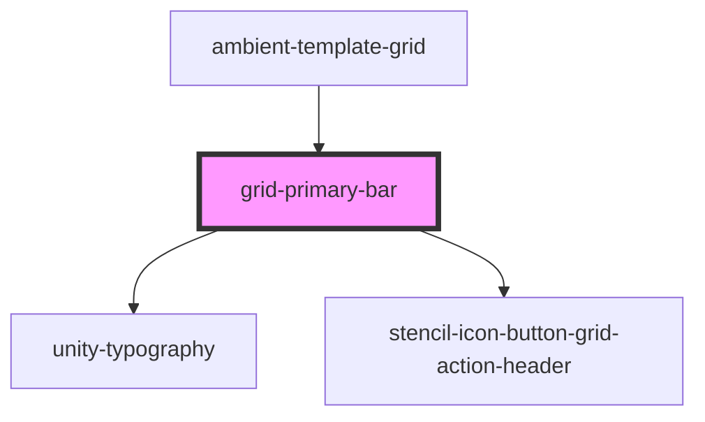

# grid-primary-bar

<!-- Auto Generated Below -->

## Properties

| Property                        | Attribute                      | Description | Type                           | Default     |
| ------------------------------- | ------------------------------ | ----------- | ------------------------------ | ----------- |
| `actionButtons`                 | --                             |             | `any[]`                        | `[]`        |
| `customAdvancedSearchClick`     | --                             |             | `(event?: MouseEvent) => void` | `undefined` |
| `customClearClick`              | --                             |             | `(event?: MouseEvent) => void` | `undefined` |
| `customColumnViewClick`         | --                             |             | `(event?: MouseEvent) => void` | `undefined` |
| `customExpandClick`             | --                             |             | `(event?: MouseEvent) => void` | `undefined` |
| `customExportClick`             | --                             |             | `(event?: MouseEvent) => void` | `undefined` |
| `customFilterViewClick`         | --                             |             | `(event?: MouseEvent) => void` | `undefined` |
| `customFitColumnClick`          | --                             |             | `(event?: MouseEvent) => void` | `undefined` |
| `customInsightsClick`           | --                             |             | `(event?: MouseEvent) => void` | `undefined` |
| `customSaveViewClick`           | --                             |             | `(event?: MouseEvent) => void` | `undefined` |
| `customShowCustomSearchClick`   | --                             |             | `(event?: MouseEvent) => void` | `undefined` |
| `customShowGridOptionsClick`    | --                             |             | `(event?: MouseEvent) => void` | `undefined` |
| `customShowHotlistClick`        | --                             |             | `(event?: MouseEvent) => void` | `undefined` |
| `customShowViewClick`           | --                             |             | `(event?: MouseEvent) => void` | `undefined` |
| `customSizeToFitClick`          | --                             |             | `(event?: MouseEvent) => void` | `undefined` |
| `customToggleServerClientClick` | --                             |             | `(event?: MouseEvent) => void` | `undefined` |
| `hiddenActionButtons`           | --                             |             | `string[]`                     | `[]`        |
| `hiddenLabels`                  | --                             |             | `string[]`                     | `[]`        |
| `primaryActionClick`            | --                             |             | `(event?: MouseEvent) => void` | `undefined` |
| `showAdvancedSearchFeature`     | `show-advanced-search-feature` |             | `boolean`                      | `true`      |
| `showFilterColumnFeature`       | `show-filter-column-feature`   |             | `boolean`                      | `true`      |
| `showGridOptions`               | `show-grid-options`            |             | `boolean`                      | `true`      |
| `showHotlistButton`             | `show-hotlist-button`          |             | `boolean`                      | `false`     |
| `title`                         | `title`                        |             | `string`                       | `undefined` |

## Dependencies

### Used by

 - [ambient-template-grid](../ambient-template-grid)

### Depends on

- [unity-typography](../../..)
- [stencil-icon-button-grid-action-header](../../buttons/icon-button)

### Graph

----------------------------------------------

*Built with [StencilJS](https://stenciljs.com/)*
