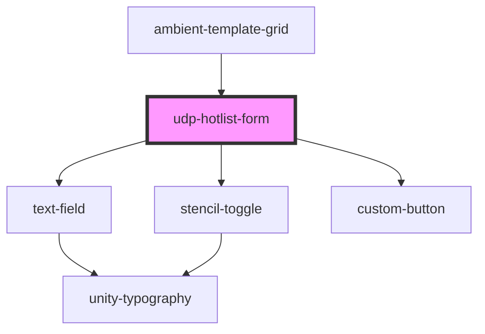

# udp-hotlist-form

<!-- Auto Generated Below -->

## Properties

| Property            | Attribute | Description | Type                                                           | Default     |
| ------------------- | --------- | ----------- | -------------------------------------------------------------- | ----------- |
| `handleCancelClick` | --        |             | `() => void`                                                   | `undefined` |
| `handleFormSubmit`  | --        |             | `(name: string, isPrivate: boolean, columnState: any) => void` | `undefined` |
| `refetchViews`      | --        |             | `() => void`                                                   | `undefined` |

## Dependencies

### Used by

 - [ambient-template-grid](../../ambient-template-grid)

### Depends on

- [text-field](../../../inputs/text-field)
- [stencil-toggle](../../../inputs/toggle)
- [custom-button](../../../buttons/icon-button/primary-button)

### Graph

----------------------------------------------

*Built with [StencilJS](https://stenciljs.com/)*
