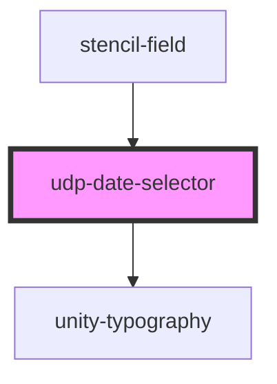

# udp-date-selector

<!-- Auto Generated Below -->

## Properties

| Property   | Attribute  | Description                                                          | Type      | Default     |
| ---------- | ---------- | -------------------------------------------------------------------- | --------- | ----------- |
| `error`    | `error`    |                                                                      | `string`  | `undefined` |
| `id`       | `id`       |                                                                      | `string`  | `undefined` |
| `label`    | `label`    |                                                                      | `string`  | `undefined` |
| `max`      | `max`      | Maximum date, supports any date supported by the js Date constructor | `string`  | `undefined` |
| `min`      | `min`      | Minimum date, supports any date supported by the js Date constructor | `string`  | `undefined` |
| `required` | `required` |                                                                      | `boolean` | `undefined` |
| `value`    | `value`    |                                                                      | `string`  | `undefined` |

## Events

| Event            | Description | Type                      |
| ---------------- | ----------- | ------------------------- |
| `udpFieldBlur`   |             | `CustomEvent<FocusEvent>` |
| `udpFieldChange` |             | `CustomEvent<string>`     |
| `udpFieldFocus`  |             | `CustomEvent<FocusEvent>` |

## Dependencies

### Used by

 - [stencil-field](../../forms/form)

### Depends on

- [unity-typography](../../..)

### Graph

----------------------------------------------

*Built with [StencilJS](https://stenciljs.com/)*
