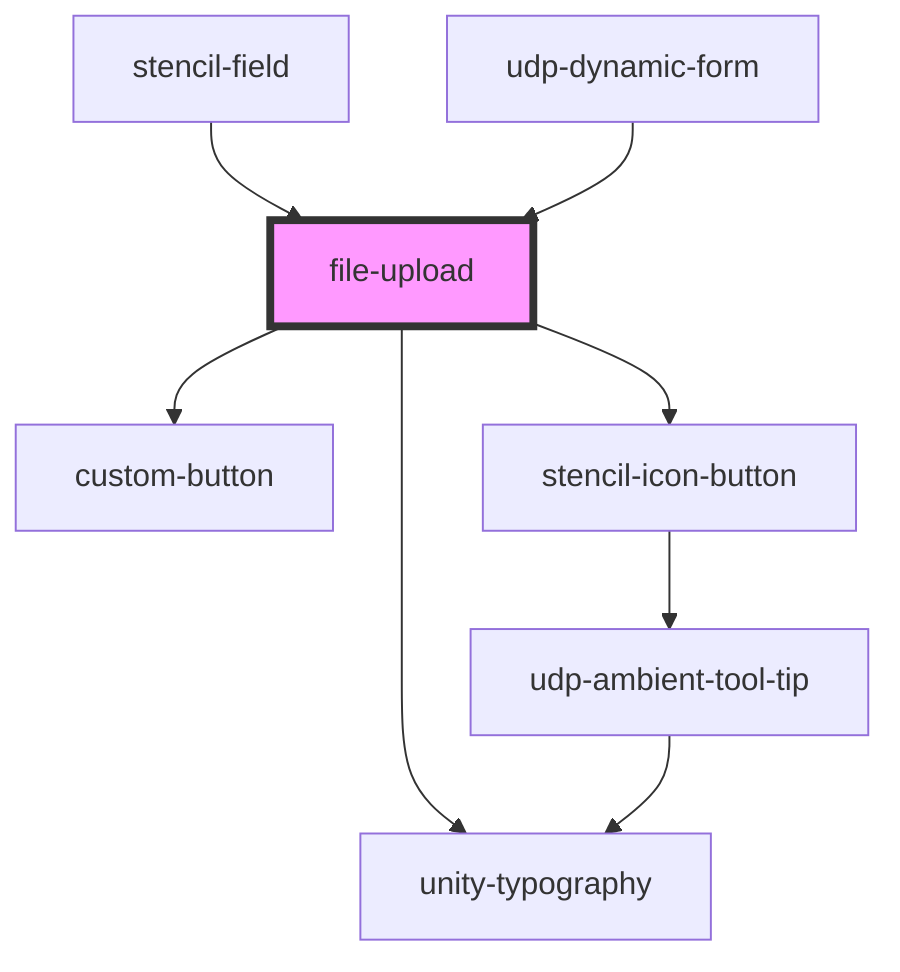

# file-upload

<!-- Auto Generated Below -->

## Properties

| Property              | Attribute               | Description | Type       | Default                           |
| --------------------- | ----------------------- | ----------- | ---------- | --------------------------------- |
| `allowMultiple`       | `allow-multiple`        |             | `boolean`  | `undefined`                       |
| `allowedFileTypes`    | --                      |             | `string[]` | `undefined`                       |
| `browseFileMessage`   | `browse-file-message`   |             | `string`   | `'Browse Files'`                  |
| `disallowedFileTypes` | --                      |             | `string[]` | `undefined`                       |
| `dragAndDropMessage`  | `drag-and-drop-message` |             | `string`   | `'Drag and drop your files here'` |
| `error`               | `error`                 |             | `string`   | `undefined`                       |
| `fullWidth`           | `full-width`            |             | `boolean`  | `false`                           |
| `hideButton`          | `hide-button`           |             | `boolean`  | `false`                           |
| `hideDragAndDrop`     | `hide-drag-and-drop`    |             | `boolean`  | `false`                           |
| `id`                  | `id`                    |             | `string`   | `undefined`                       |
| `required`            | `required`              |             | `boolean`  | `undefined`                       |

## Events

| Event            | Description | Type                  |
| ---------------- | ----------- | --------------------- |
| `udpFieldBlur`   |             | `CustomEvent<Event>`  |
| `udpFieldChange` |             | `CustomEvent<File[]>` |

## Dependencies

### Used by

 - [stencil-field](../../forms/form)
 - [udp-dynamic-form](../../forms/dynamic-form)

### Depends on

- [unity-typography](../../..)
- [custom-button](../../buttons/icon-button/primary-button)
- [stencil-icon-button](../../buttons/icon-button)

### Graph

----------------------------------------------

*Built with [StencilJS](https://stenciljs.com/)*
