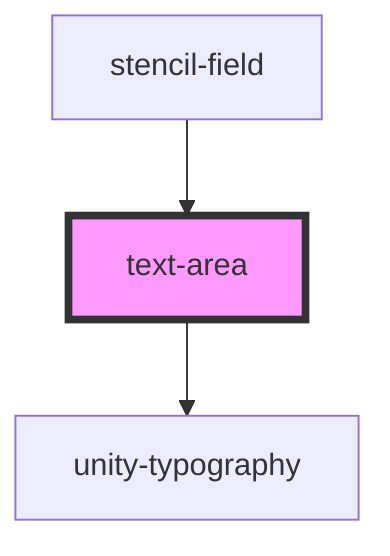

# text-area

<!-- Auto Generated Below -->

## Properties

| Property       | Attribute       | Description | Type                          | Default     |
| -------------- | --------------- | ----------- | ----------------------------- | ----------- |
| `disabled`     | `disabled`      |             | `boolean`                     | `undefined` |
| `error`        | `error`         |             | `string`                      | `undefined` |
| `fullWidth`    | `full-width`    |             | `boolean`                     | `undefined` |
| `handleBlur`   | --              |             | `(event: FocusEvent) => void` | `undefined` |
| `handleChange` | --              |             | `(event: Event) => void`      | `undefined` |
| `handleFocus`  | --              |             | `(event: FocusEvent) => void` | `undefined` |
| `id`           | `id`            |             | `string`                      | `undefined` |
| `label`        | `label`         |             | `string`                      | `undefined` |
| `maxCharacter` | `max-character` |             | `number`                      | `undefined` |
| `placeholder`  | `placeholder`   |             | `string`                      | `undefined` |
| `readOnly`     | `read-only`     |             | `boolean`                     | `undefined` |
| `required`     | `required`      |             | `boolean`                     | `undefined` |
| `rows`         | `rows`          |             | `number`                      | `6`         |
| `value`        | `value`         |             | `string`                      | `undefined` |

## Events

| Event            | Description | Type                      |
| ---------------- | ----------- | ------------------------- |
| `udpFieldBlur`   |             | `CustomEvent<FocusEvent>` |
| `udpFieldChange` |             | `CustomEvent<string>`     |
| `udpFieldFocus`  |             | `CustomEvent<FocusEvent>` |

## Dependencies

### Used by

 - [stencil-field](../../forms/form)

### Depends on

- [unity-typography](../../..)

### Graph

----------------------------------------------

*Built with [StencilJS](https://stenciljs.com/)*
