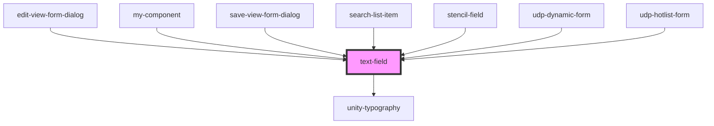

# text-field

<!-- Auto Generated Below -->

## Properties

| Property       | Attribute       | Description | Type                     | Default     |
| -------------- | --------------- | ----------- | ------------------------ | ----------- |
| `disabled`     | `disabled`      |             | `boolean`                | `undefined` |
| `error`        | `error`         |             | `string`                 | `''`        |
| `handleBlur`   | --              |             | `(event: Event) => void` | `undefined` |
| `handleFocus`  | --              |             | `(event: Event) => void` | `undefined` |
| `handleInput`  | --              |             | `(event: Event) => void` | `undefined` |
| `hidden`       | `hidden`        |             | `boolean`                | `undefined` |
| `id`           | `id`            |             | `string`                 | `undefined` |
| `label`        | `label`         |             | `string`                 | `undefined` |
| `maxCharacter` | `max-character` |             | `number`                 | `undefined` |
| `placeholder`  | `placeholder`   |             | `string`                 | `undefined` |
| `readOnly`     | `read-only`     |             | `boolean`                | `undefined` |
| `required`     | `required`      |             | `boolean`                | `undefined` |
| `value`        | `value`         |             | `string`                 | `undefined` |

## Events

| Event            | Description | Type                      |
| ---------------- | ----------- | ------------------------- |
| `udpFieldBlur`   |             | `CustomEvent<FocusEvent>` |
| `udpFieldChange` |             | `CustomEvent<string>`     |
| `udpFieldFocus`  |             | `CustomEvent<FocusEvent>` |

## Dependencies

### Used by

 - [edit-view-form-dialog](../../forms/edit-view-form)
 - [my-component](../../..)
 - [save-view-form-dialog](../../forms/save-view-form)
 - [search-list-item](../../data-display/tree/tree-list-item/search-item)
 - [stencil-field](../../forms/form)
 - [udp-dynamic-form](../../forms/dynamic-form)
 - [udp-hotlist-form](../../grid/hotlists/udp-hotlist-form)

### Depends on

- [unity-typography](../../..)

### Graph

----------------------------------------------

*Built with [StencilJS](https://stenciljs.com/)*
