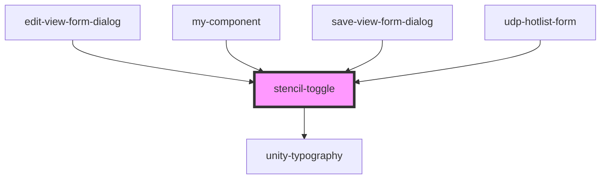

# stencil-toggle

<!-- Auto Generated Below -->

## Properties

| Property   | Attribute  | Description | Type      | Default     |
| ---------- | ---------- | ----------- | --------- | ----------- |
| `checked`  | `checked`  |             | `boolean` | `undefined` |
| `disabled` | `disabled` |             | `boolean` | `false`     |
| `idItem`   | `id-item`  |             | `string`  | `undefined` |
| `label`    | `label`    |             | `string`  | `undefined` |

## Events

| Event           | Description | Type               |
| --------------- | ----------- | ------------------ |
| `toggledChange` |             | `CustomEvent<any>` |

## Dependencies

### Used by

 - [edit-view-form-dialog](../../forms/edit-view-form)
 - [my-component](../../..)
 - [save-view-form-dialog](../../forms/save-view-form)
 - [udp-hotlist-form](../../grid/hotlists/udp-hotlist-form)

### Depends on

- [unity-typography](../../..)

### Graph

----------------------------------------------

*Built with [StencilJS](https://stenciljs.com/)*
