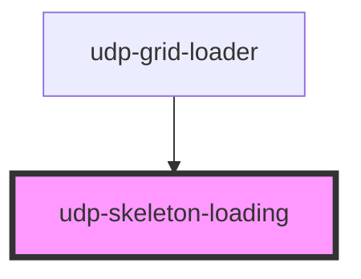

# udp-skeleton-loading

<!-- Auto Generated Below -->

## Properties

| Property       | Attribute       | Description | Type     | Default  |
| -------------- | --------------- | ----------- | -------- | -------- |
| `borderRadius` | `border-radius` |             | `string` | `'4px'`  |
| `height`       | `height`        |             | `string` | `'20px'` |
| `width`        | `width`         |             | `string` | `'100%'` |

## Dependencies

### Used by

 - [udp-grid-loader](udp-grid-loader)

### Graph

----------------------------------------------

*Built with [StencilJS](https://stenciljs.com/)*
