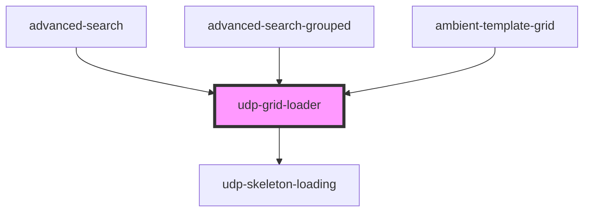

# udp-grid-loader

<!-- Auto Generated Below -->

## Properties

| Property     | Attribute     | Description | Type     | Default                |
| ------------ | ------------- | ----------- | -------- | ---------------------- |
| `numColumns` | `num-columns` |             | `number` | `8`                    |
| `numRows`    | `num-rows`    |             | `number` | `5`                    |
| `width`      | `width`       |             | `string` | `'calc(100vw - 70px)'` |

## Dependencies

### Used by

 - [advanced-search](../../advanced-search)
 - [advanced-search-grouped](../../advanced-search)
 - [ambient-template-grid](../../grid/ambient-template-grid)

### Depends on

- [udp-skeleton-loading](..)

### Graph

----------------------------------------------

*Built with [StencilJS](https://stenciljs.com/)*
