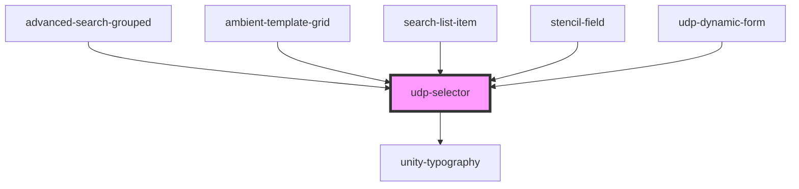

# udp-selector

<!-- Auto Generated Below -->

## Properties

| Property        | Attribute        | Description | Type                                  | Default     |
| --------------- | ---------------- | ----------- | ------------------------------------- | ----------- |
| `defaultOption` | `default-option` |             | `string`                              | `undefined` |
| `error`         | `error`          |             | `string`                              | `undefined` |
| `fieldName`     | `field-name`     |             | `string`                              | `undefined` |
| `id`            | `id`             |             | `string`                              | `undefined` |
| `label`         | `label`          |             | `string`                              | `undefined` |
| `large`         | `large`          |             | `boolean`                             | `false`     |
| `multiSelect`   | `multi-select`   |             | `boolean`                             | `false`     |
| `options`       | --               |             | `{ value: string; label: string; }[]` | `[]`        |
| `required`      | `required`       |             | `boolean`                             | `undefined` |

## Events

| Event            | Description | Type                    |
| ---------------- | ----------- | ----------------------- |
| `optionSelected` |             | `CustomEvent<any>`      |
| `udpFieldBlur`   |             | `CustomEvent<Event>`    |
| `udpFieldChange` |             | `CustomEvent<Object[]>` |

## Dependencies

### Used by

 - [advanced-search-grouped](../advanced-search)
 - [ambient-template-grid](../grid/ambient-template-grid)
 - [search-list-item](../data-display/tree/tree-list-item/search-item)
 - [stencil-field](../forms/form)
 - [udp-dynamic-form](../forms/dynamic-form)

### Depends on

- [unity-typography](../..)

### Graph

----------------------------------------------

*Built with [StencilJS](https://stenciljs.com/)*
