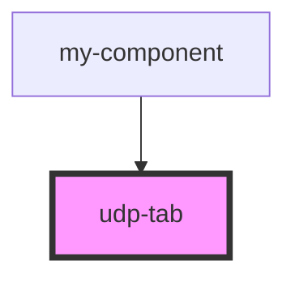

# udp-tab

<!-- Auto Generated Below -->

## Properties

| Property | Attribute | Description | Type      | Default     |
| -------- | --------- | ----------- | --------- | ----------- |
| `active` | `active`  |             | `boolean` | `undefined` |
| `title`  | `title`   |             | `string`  | `undefined` |

## Dependencies

### Used by

 - [my-component](../../..)

### Graph

----------------------------------------------

*Built with [StencilJS](https://stenciljs.com/)*
