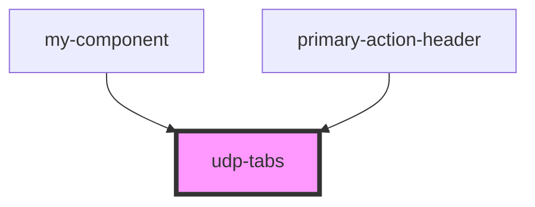

# udp-tabs

<!-- Auto Generated Below -->

## Dependencies

### Used by

 - [my-component](../../../..)
 - [primary-action-header](../../../data-display/primary-action-header)

### Graph

----------------------------------------------

*Built with [StencilJS](https://stenciljs.com/)*
