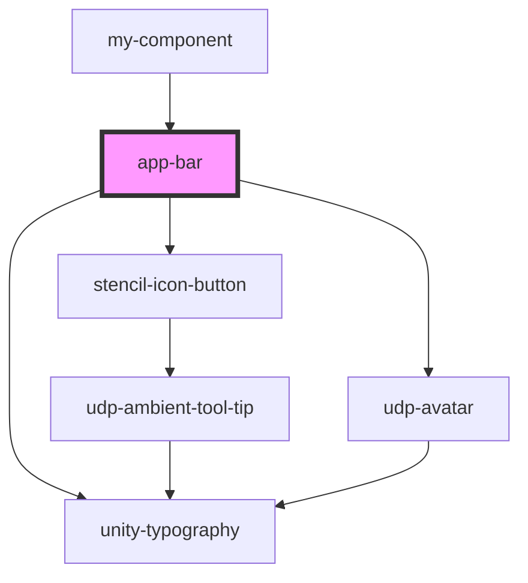

# app-bar

<!-- Auto Generated Below -->

## Properties

| Property   | Attribute  | Description | Type     | Default     |
| ---------- | ---------- | ----------- | -------- | ----------- |
| `username` | `username` |             | `string` | `undefined` |

## Dependencies

### Used by

 - [my-component](../../..)

### Depends on

- [stencil-icon-button](../../buttons/icon-button)
- [unity-typography](../../..)
- [udp-avatar](../../data-display/udp-avatar)

### Graph

----------------------------------------------

*Built with [StencilJS](https://stenciljs.com/)*
