# my-component

<!-- Auto Generated Below -->

## Properties

| Property  | Attribute | Description | Type                                                                                                                                                                              | Default  |
| --------- | --------- | ----------- | --------------------------------------------------------------------------------------------------------------------------------------------------------------------------------- | -------- |
| `variant` | `variant` |             | `"body" \| "button" \| "caption-text" \| "data-display-four" \| "data-display-one" \| "data-display-three" \| "data-display-two" \| "h1" \| "h2" \| "h3" \| "h4" \| "h5" \| "h6"` | `'body'` |

## Dependencies

### Used by

 - [ambient-demo-container](demo)
 - [ambient-template-grid](./UI/grid/ambient-template-grid)
 - [app-bar](./UI/toolbars/app-bar)
 - [file-upload](./UI/inputs/file-upload)
 - [fluent-dialog](./UI/dialogs/fluent-dialog)
 - [grid-primary-bar](./UI/grid/grid-primary-bar)
 - [hint-panel](./UI/data-display/hint-panel)
 - [kpi-list](./UI/data-display/kpi)
 - [logical-search-indicator](./UI/advanced-search/ui/logical-search-indicator)
 - [my-component](.)
 - [page-renderer](../../page-renderer)
 - [primary-action-header](./UI/data-display/primary-action-header)
 - [search-list-item](./UI/data-display/tree/tree-list-item/search-item)
 - [selectable-list](./UI/inputs/selectable-list)
 - [side-sheet](./UI/drawers/side-sheet)
 - [status-chip](./UI/data-display/chips/stencil-chip/status-chip)
 - [stencil-chip](./UI/data-display/chips/stencil-chip)
 - [stencil-toggle](./UI/inputs/toggle)
 - [text-area](./UI/inputs/text-area)
 - [text-field](./UI/inputs/text-field)
 - [tree-list-item](./UI/data-display/tree/tree-list-item)
 - [udp-ambient-card](./UI/data-display/cards/udp-ambient-card)
 - [udp-ambient-tool-tip](./UI/data-display/tool-tip)
 - [udp-avatar](./UI/data-display/udp-avatar)
 - [udp-badge](./UI/data-display/badge)
 - [udp-column-header](./UI/data-display/headers)
 - [udp-date-selector](./UI/inputs/date-selector)
 - [udp-datetime-selector](./UI/inputs/date-time-selector)
 - [udp-forms-renderer](./UI/forms/udp-forms/udp-forms-renderer)
 - [udp-menu-item](./UI/menu/menu-item)
 - [udp-notification](./UI/feedback/udp-notification)
 - [udp-page-header](./UI/data-display/headers/udp-page-header)
 - [udp-pop-over](./UI/data-display/pop-over)
 - [udp-pop-over-grid-action-header](./UI/data-display/pop-over-grid-action-header)
 - [udp-question](./UI/forms/udp-forms/udp-question)
 - [udp-radio-button](./UI/buttons/icon-button/radio-button)
 - [udp-selector](./UI/selector)
 - [udp-time-selector](./UI/inputs/time-selector)
 - [upd-alert-banner](./UI/feedback/udp-notification/alerts)

### Graph

```mermaid
graph TD;
  ambient-demo-container --> unity-typography
  ambient-template-grid --> unity-typography
  app-bar --> unity-typography
  file-upload --> unity-typography
  fluent-dialog --> unity-typography
  grid-primary-bar --> unity-typography
  hint-panel --> unity-typography
  kpi-list --> unity-typography
  logical-search-indicator --> unity-typography
  my-component --> unity-typography
  page-renderer --> unity-typography
  primary-action-header --> unity-typography
  search-list-item --> unity-typography
  selectable-list --> unity-typography
  side-sheet --> unity-typography
  status-chip --> unity-typography
  stencil-chip --> unity-typography
  stencil-toggle --> unity-typography
  text-area --> unity-typography
  text-field --> unity-typography
  tree-list-item --> unity-typography
  udp-ambient-card --> unity-typography
  udp-ambient-tool-tip --> unity-typography
  udp-avatar --> unity-typography
  udp-badge --> unity-typography
  udp-column-header --> unity-typography
  udp-date-selector --> unity-typography
  udp-datetime-selector --> unity-typography
  udp-forms-renderer --> unity-typography
  udp-menu-item --> unity-typography
  udp-notification --> unity-typography
  udp-page-header --> unity-typography
  udp-pop-over --> unity-typography
  udp-pop-over-grid-action-header --> unity-typography
  udp-question --> unity-typography
  udp-radio-button --> unity-typography
  udp-selector --> unity-typography
  udp-time-selector --> unity-typography
  upd-alert-banner --> unity-typography
  style unity-typography fill:#f9f,stroke:#333,stroke-width:4px
```

----------------------------------------------

*Built with [StencilJS](https://stenciljs.com/)*
