# page-renderer

<!-- Auto Generated Below -->

## Properties

| Property      | Attribute      | Description | Type     | Default     |
| ------------- | -------------- | ----------- | -------- | ----------- |
| `accessToken` | `access-token` |             | `string` | `undefined` |
| `gridId`      | `grid-id`      |             | `string` | `undefined` |
| `pageData`    | `page-data`    |             | `any`    | `undefined` |
| `productId`   | `product-id`   |             | `string` | `undefined` |
| `tenantId`    | `tenant-id`    |             | `string` | `undefined` |
| `userId`      | `user-id`      |             | `string` | `undefined` |

## Dependencies

### Depends on

- [unity-typography](../components/my-component)
- [ambient-template-grid](../components/my-component/UI/grid/ambient-template-grid)

### Graph

```mermaid
graph TD;
  page-renderer --> unity-typography
  page-renderer --> ambient-template-grid
  ambient-template-grid --> stencil-chip
  ambient-template-grid --> udp-notification
  ambient-template-grid --> grid-primary-bar
  ambient-template-grid --> udp-pop-over-grid-action-header
  ambient-template-grid --> stencil-icon-button-grid-action-header
  ambient-template-grid --> unity-typography
  ambient-template-grid --> udp-divider
  ambient-template-grid --> udp-badge
  ambient-template-grid --> udp-selector
  ambient-template-grid --> udp-dynamic-container-with-menu
  ambient-template-grid --> stencil-icon-button
  ambient-template-grid --> udp-pop-over
  ambient-template-grid --> kpi-list
  ambient-template-grid --> udp-linear-loader
  ambient-template-grid --> udp-grid-loader
  ambient-template-grid --> upd-alert-banner
  ambient-template-grid --> ag-table
  ambient-template-grid --> side-sheet
  ambient-template-grid --> advanced-search
  ambient-template-grid --> hint-panel
  ambient-template-grid --> tree-list-item
  ambient-template-grid --> advanced-search-grouped
  ambient-template-grid --> udp-hotlist-form
  ambient-template-grid --> save-view-form-dialog
  ambient-template-grid --> edit-view-form-dialog
  ambient-template-grid --> fluent-dialog
  stencil-chip --> unity-typography
  udp-notification --> unity-typography
  grid-primary-bar --> unity-typography
  grid-primary-bar --> stencil-icon-button-grid-action-header
  udp-pop-over-grid-action-header --> unity-typography
  udp-badge --> unity-typography
  udp-selector --> unity-typography
  udp-dynamic-container-with-menu --> stencil-chip
  udp-dynamic-container-with-menu --> udp-pop-over
  udp-pop-over --> unity-typography
  stencil-icon-button --> udp-ambient-tool-tip
  udp-ambient-tool-tip --> unity-typography
  kpi-list --> unity-typography
  udp-grid-loader --> udp-skeleton-loading
  upd-alert-banner --> unity-typography
  upd-alert-banner --> stencil-icon-button
  side-sheet --> stencil-icon-button
  side-sheet --> unity-typography
  side-sheet --> custom-button
  side-sheet --> side-sheet-container
  advanced-search --> udp-grid-loader
  advanced-search --> tree-list-item
  advanced-search --> udp-page-header
  advanced-search --> filter-conditions
  advanced-search --> search-list-item
  tree-list-item --> tree-list-item
  tree-list-item --> unity-typography
  tree-list-item --> status-chip
  tree-list-item --> udp-function-button
  status-chip --> unity-typography
  udp-page-header --> unity-typography
  udp-page-header --> udp-radio-button
  udp-radio-button --> unity-typography
  filter-conditions --> udp-column-header
  udp-column-header --> unity-typography
  search-list-item --> unity-typography
  search-list-item --> udp-selector
  search-list-item --> text-field
  search-list-item --> stencil-icon-button
  text-field --> unity-typography
  hint-panel --> unity-typography
  advanced-search-grouped --> udp-selector
  advanced-search-grouped --> stencil-icon-button
  advanced-search-grouped --> search-list-item
  advanced-search-grouped --> custom-button
  advanced-search-grouped --> udp-function-button
  advanced-search-grouped --> udp-grid-loader
  advanced-search-grouped --> tree-list-item
  udp-hotlist-form --> text-field
  udp-hotlist-form --> stencil-toggle
  udp-hotlist-form --> custom-button
  stencil-toggle --> unity-typography
  save-view-form-dialog --> fluent-dialog
  save-view-form-dialog --> text-field
  save-view-form-dialog --> stencil-toggle
  fluent-dialog --> unity-typography
  fluent-dialog --> custom-button
  edit-view-form-dialog --> fluent-dialog
  edit-view-form-dialog --> text-field
  edit-view-form-dialog --> stencil-toggle
  style page-renderer fill:#f9f,stroke:#333,stroke-width:4px
```

----------------------------------------------

*Built with [StencilJS](https://stenciljs.com/)*
