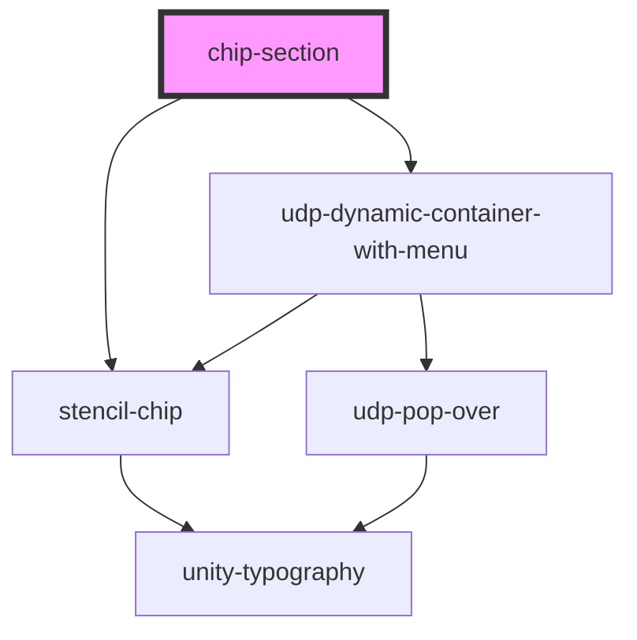

# chip-section

<!-- Auto Generated Below -->

## Properties

| Property                | Attribute              | Description | Type       | Default     |
| ----------------------- | ---------------------- | ----------- | ---------- | ----------- |
| `additionalFilterChips` | --                     |             | `any[]`    | `[]`        |
| `filterChips`           | --                     |             | `any[]`    | `[]`        |
| `handleDelete`          | --                     |             | `Function` | `undefined` |
| `hideKpiSection`        | `hide-kpi-section`     |             | `boolean`  | `false`     |
| `kpiValues`             | --                     |             | `any[]`    | `[]`        |
| `maxKPIsDisplayed`      | `max-k-p-is-displayed` |             | `number`   | `4`         |
| `menuItems`             | --                     |             | `any[]`    | `[]`        |
| `viewChips`             | --                     |             | `any[]`    | `[]`        |

## Dependencies

### Depends on

- [stencil-chip](../../../../components/my-component/UI/data-display/chips/stencil-chip)
- [udp-dynamic-container-with-menu](..)

### Graph

----------------------------------------------

*Built with [StencilJS](https://stenciljs.com/)*
