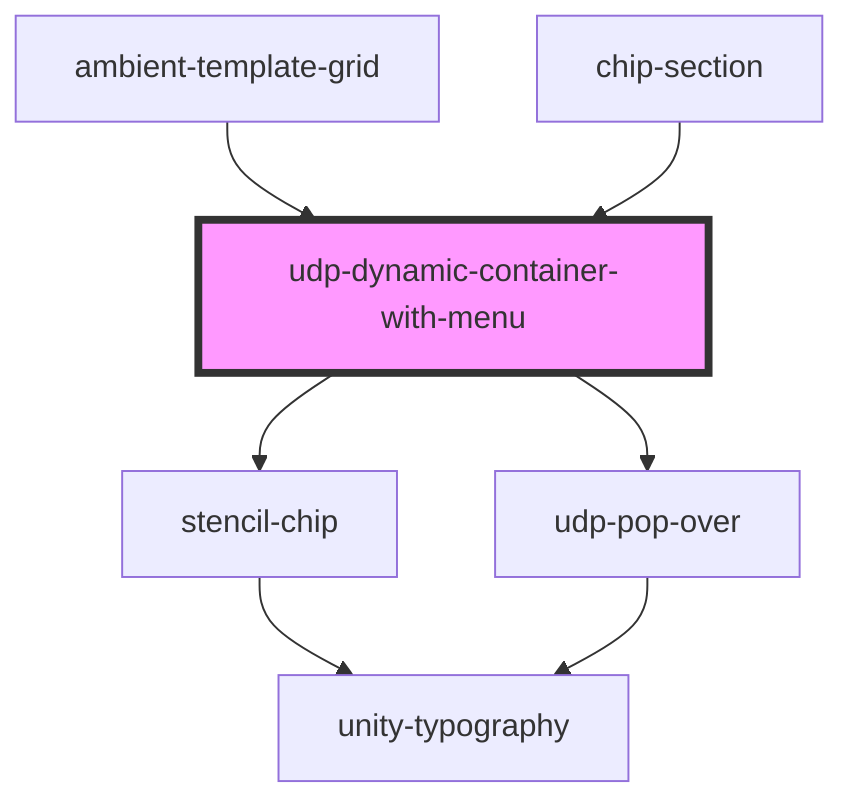

# udp-dynamic-container-with-menu

<!-- Auto Generated Below -->

## Properties

| Property         | Attribute         | Description | Type     | Default |
| ---------------- | ----------------- | ----------- | -------- | ------- |
| `externalToggle` | `external-toggle` |             | `string` | `''`    |
| `menuItems`      | --                |             | `any[]`  | `[]`    |

## Events

| Event            | Description | Type                  |
| ---------------- | ----------- | --------------------- |
| `udpChipClicked` |             | `CustomEvent<string>` |

## Methods

### `calculateChildren() => Promise<void>`

#### Returns

Type: `Promise<void>`

## Dependencies

### Used by

 - [ambient-template-grid](../../../components/my-component/UI/grid/ambient-template-grid)
 - [chip-section](chip-section)

### Depends on

- [stencil-chip](../../../components/my-component/UI/data-display/chips/stencil-chip)
- [udp-pop-over](../../../components/my-component/UI/data-display/pop-over)

### Graph

----------------------------------------------

*Built with [StencilJS](https://stenciljs.com/)*
